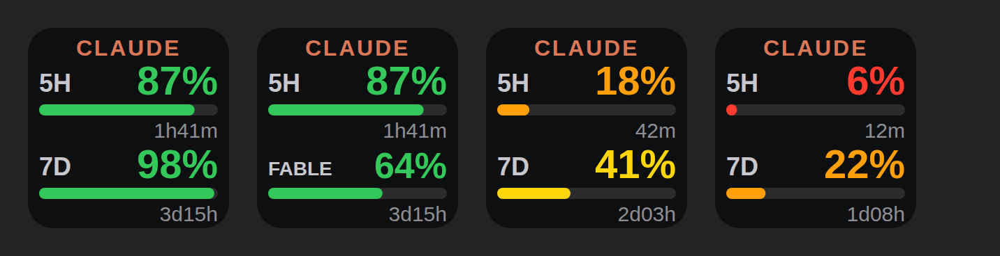

# Stream Deck — Claude Usage

Show how much of your Claude quota is left on a single Stream Deck key: the 5‑hour session window on top, the weekly window underneath, and the time until each one resets.

日本語版は [README.ja.md](README.ja.md) にあります。



## What it shows

| Row | Meaning |
| --- | --- |
| `5H` | The 5‑hour session window |
| `7D` | The weekly window (all models) |
| Bar | How much is left, not how much is used |
| Small text under the bar | Time until that window resets (`1h41m`, `3d15h`) |

Colours follow what's **left**: green above 50 %, yellow at 50 %, orange at 25 %, red at 10 % or below.

If your plan has model‑scoped weekly windows (Opus, Sonnet, Fable, …), a **short press cycles the bottom row** through them — `7D` → `FABLE` → `7D`. The choice is saved per key. A **long press (0.5 s or more)** launches the Claude desktop app and refreshes immediately.

## Requirements

- Windows 10 or later
- Stream Deck software 6.6 or later (it ships the Node.js 20 runtime the plugin needs)
- Claude Code CLI, logged in — the plugin reads the token it stores

## Install

1. Download this repository (**Code → Download ZIP**) and unzip it.
2. Copy the `com.yuya.claudeusage.sdPlugin` folder into:
   ```
   %APPDATA%\Elgato\StreamDeck\Plugins\
   ```
3. Quit Stream Deck completely (right‑click the tray icon → **Quit** — closing the window is not enough) and start it again.
4. Drag **Claude Usage → Claude 残量** onto a key.

## Authentication

Run `claude` once in PowerShell and log in. The plugin then reads
`%USERPROFILE%\.claude\.credentials.json` and refreshes the token itself when it
expires, writing the new pair back so the CLI keeps working.

> A token from `claude setup-token` will **not** work. It is scoped for inference
> only and the usage endpoint rejects it with
> `OAuth token does not meet scope requirement user:profile`.

The token field in the settings is optional and only useful if you want to point
the key at a different account's OAuth token.

## Settings

| Setting | Default | Notes |
| --- | --- | --- |
| Token | empty | Leave empty to use the Claude Code login |
| Update interval | 3 min | The usage endpoint rate‑limits aggressively; 3 minutes or more is recommended |
| Display | Remaining % | Switch to Used % if you prefer counting up |
| On press | Short = switch / long = launch | Or: launch + refresh, launch only, refresh only |
| Launch command | empty | Auto‑detects the Claude desktop app; set this to open something else |

## Build from source

```bash
npm install
npm run build   # bundles src/ into com.yuya.claudeusage.sdPlugin/bin/plugin.js
```

`npm run watch` rebuilds on change. The bundled output is committed so the plugin
can be installed without a toolchain.

## How the data is fetched

`GET https://api.anthropic.com/api/oauth/usage` with the OAuth access token, then
the `limits` array of the response is read: `kind: "session"` becomes the top row,
and every entry with `group: "weekly"` becomes one page of the bottom row
(`scope.model.display_name` supplies the label).

**This endpoint is not documented or supported by Anthropic.** It can change or
disappear without notice, and this plugin is not affiliated with Anthropic or
Elgato. Nothing is sent anywhere except to Anthropic's own API; the token never
leaves your machine.

## When something is wrong

| Key shows | Meaning |
| --- | --- |
| `NO LOGIN` | No credentials found — run `claude` and log in |
| `BAD SCOPE` | The token in the settings lacks `user:profile` — clear it |
| `AUTH EXPIRED` | Refresh failed — run `claude` and log in again |
| `RATE LIMITED` | Too many requests; the plugin backs off for 5 minutes |
| `OFFLINE` | The request failed; it retries on the next tick |

If a refresh fails after the key has already shown numbers, the last known values stay
on screen with a `*` next to the title rather than being replaced by an error. After 30
minutes without a successful refresh, the key switches to the reason instead.

Plugin logs live in `com.yuya.claudeusage.sdPlugin/logs/`.

## License

MIT — see [LICENSE](LICENSE).
